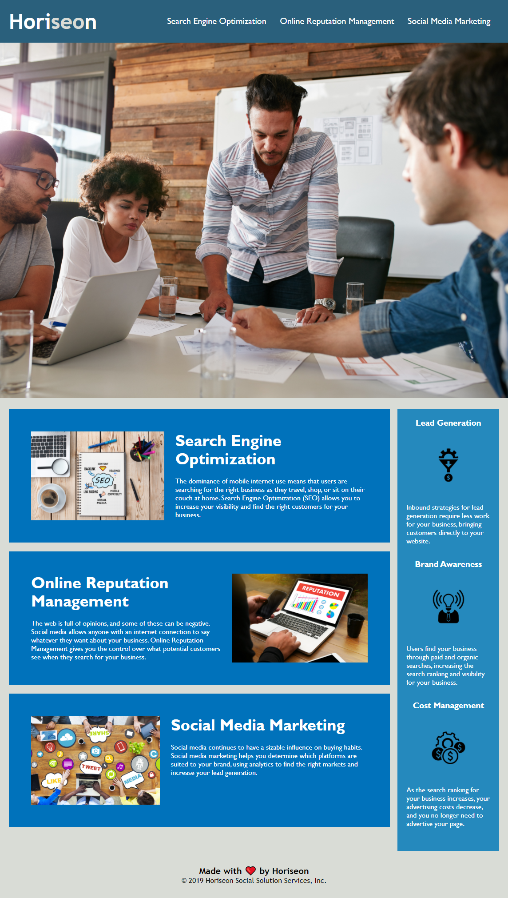

# Code-Refractor-Assignment

## Description

The Horiseon webpage output remains the same but the code within the HTML and CSS files have been cleaned up to make the application more accessible and readible. 

HTML elements have been updated to follow the semantic structure.

Comments before each HTML section have been added to decribe what the section is for.

Alt attributes have been added to the images to make them more accessible. 

Comments have been added to the CSS style file to help explain what each section of styling is for. 

Selectors and properties within the CSS file have been consildated to increase the efficiency of the CSS.

All links are now functioning correctly.  

## Assets

The following image shows the web application's appearance and functionality:

> **Note**: This layout is designed for desktop viewing, so you may notice that some of the elements don't look like the screenshot at a resolution smaller than 768px.

## Link

The link to the deployed application:

Horiseon Social Solution Services: https://trushilbudhia.github.io/Code-Refractor-Assignment/